<a name="readme-top"></a>

## PERTANYAAN SOAL
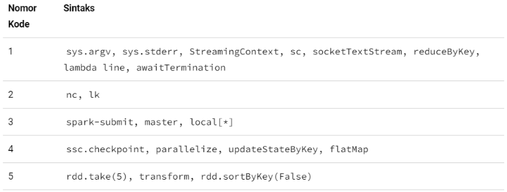

## TUGAS 6

1. Silakan selesaikan praktikum tersebut sesuai langkah-langkah sebelumnya, lalu laporkan hasilnya berupa link repository GitHub dengan nama **spark-streaming** disertai dengan screenshot hasilnya.
2. Jelaskan perbedaan spark streaming dengan metode stateless dan stateful stream processing ?
3. Jelaskan masing-masing maksud kode berikut sesuai nomor kodenya pada laporan praktikum Anda!

<!-- TABLE OF CONTENTS -->
<!-- <details>
  <summary>Daftar Isi</summary>
  <ol>
    <li>
      <a href="# Pertanyaan">Pertanyaan</a>
      <ul>
        <li><a href="# Jelaskan perbedaan spark streaming dengan metode stateless dan stateful stream processing">Jelaskan perbedaan spark streaming dengan metode stateless dan stateful stream processing</a></li>
      </ul>
    </li>
    <li>
      <a href="#screenshot-hasil">Screenshoot Hasil</a>
    </li>
  </ol>
</details> -->


## Jelaskan perbedaan spark streaming dengan metode stateless dan stateful stream processing
```sh
Spark Streaming adalah modul di Apache Spark yang memungkinkan pemrosesan data secara real-time dengan menggabungkan konsep pemrograman batch dan streaming. 

1. Stateless Stream Processing:
Stateless stream processing dalam Spark Streaming mengacu pada pemrosesan di mana setiap batch data yang masuk diperlakukan secara independen, tanpa mempertahankan informasi state (keadaan) antar batch. Dalam pendekatan ini, setiap batch data dianggap sebagai entitas terpisah yang dianalisis secara mandiri.
Contoh penggunaan stateless stream processing adalah menghitung frekuensi kemunculan kata-kata dalam setiap batch data streaming.

2. Stateful Stream Processing:
Stateful stream processing melibatkan mempertahankan keadaan (state) antar batch data dalam pemrosesan streaming. Dalam pendekatan ini, Spark Streaming dapat menyimpan dan mengakses status atau informasi dari batch sebelumnya saat menganalisis batch data saat ini. 
Contoh penggunaan stateful stream processing adalah menghitung jumlah kata yang unik dalam setiap batch data streaming. 

Kesimpulan : Perbedaan utama antara stateless dan stateful stream processing adalah kemampuan stateful processing untuk mempertahankan dan mengakses keadaan dari batch sebelumnya. Stateless processing, di sisi lain, hanya menganalisis setiap batch data secara independen tanpa mempertahankan keadaan.
```
## JAWABAN PERTANYAAN SOAL
  ```sh
  1. - sys.argv: Variabel yang berisi argumen baris perintah saat menjalankan skrip Python.
     - sys.stderr: Saluran standar untuk output kesalahan.
     - StreamingContext: Konteks inti dalam Spark Streaming untuk pemrosesan streaming.
     - sc: SparkContext untuk berinteraksi dengan kluster Spark.
     - socketTextStream: Membuat DStream dari data yang diterima melalui socket.
     - reduceByKey: Menggabungkan nilai-nilai dengan kunci yang sama dalam RDD menggunakan fungsi pengurangan.
     - lambda line: Fungsi anonim dengan satu parameter line.
     - awaitTermination: Meminta StreamingContext agar tetap berjalan hingga pemrosesan streaming selesai.
  ```
  ```sh
  2. - nc, lk: Utilitas netcat untuk membuka koneksi dan mengirim/menerima data melalui jaringan.
  ```
  ```sh
  3. - spark-submit: Perintah untuk mengirimkan aplikasi Spark ke kluster Spark untuk dieksekusi.
     - master: Argumen untuk menentukan alamat URL atau mode eksekusi kluster Spark.
     - local[*]: Mode eksekusi Spark lokal dengan menggunakan semua core yang tersedia pada mesin.
  ```
  ```sh
  4. - ssc.checkpoint: Mengatur tempat penyimpanan sementara (checkpoint) untuk operasi pemrosesan streaming stateful.
     - parallelize: Membuat RDD dari koleksi data yang ada di memori dalam bentuk array.
     - updateStateByKey: Memperbarui state (keadaan) pada DStream dengan menggabungkan nilai-nilai yang memiliki kunci yang sama.
     - flatMap: Membagi setiap elemen dalam RDD menjadi beberapa elemen dalam bentuk yang berbeda.
  ```
  ```sh
  5. - rdd.take(5): Mengambil n elemen pertama dari RDD dan mengembalikannya dalam bentuk list.
     - transform: Menerapkan transformasi pada DStream.
     - rdd.sortByKey(False): Mengurutkan pasangan kunci-nilai dalam RDD berdasarkan kunci secara menurun (descending order).
  ```

## SS CLAUDERA
    Stateless

      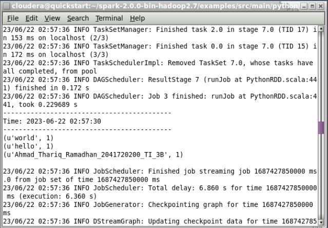
      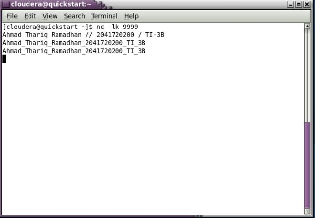
      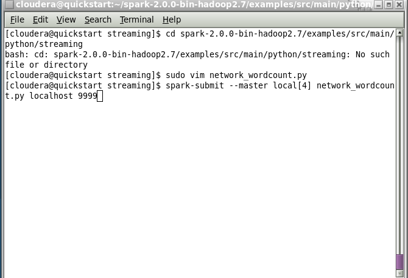
      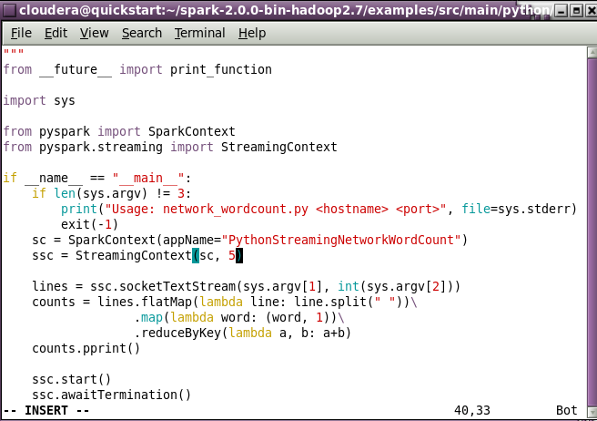
      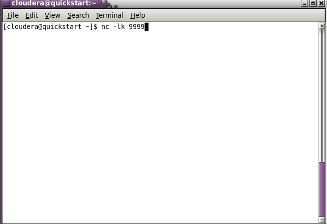
      
    Stateful
    
      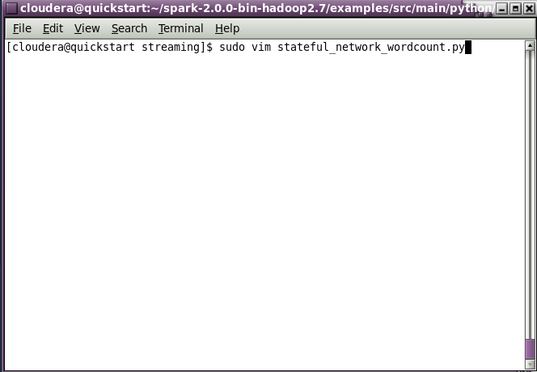
      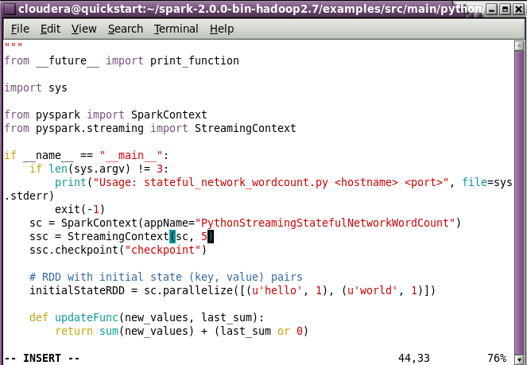
      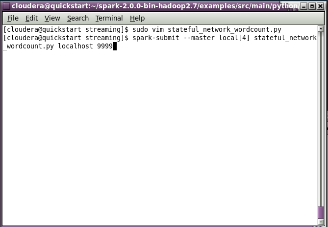
      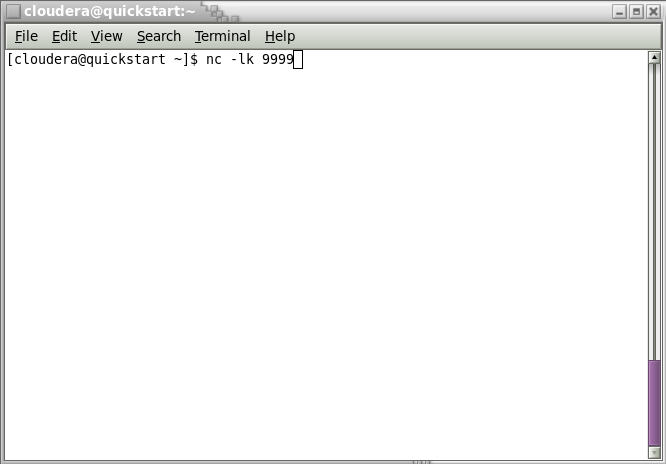
      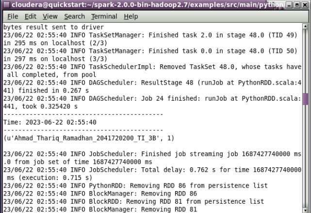
      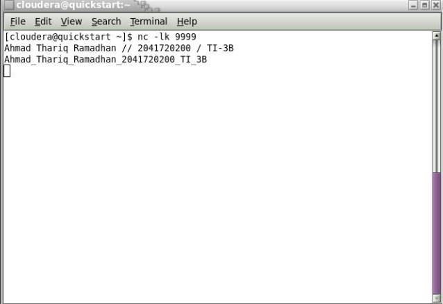
      
    Transformasi Word Sentiment
    
      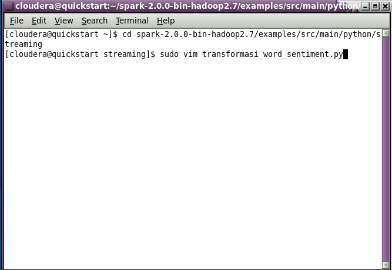
      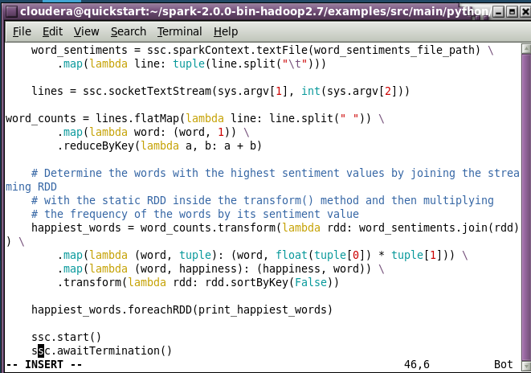
      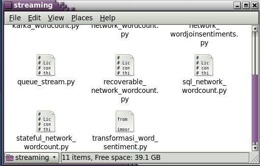
      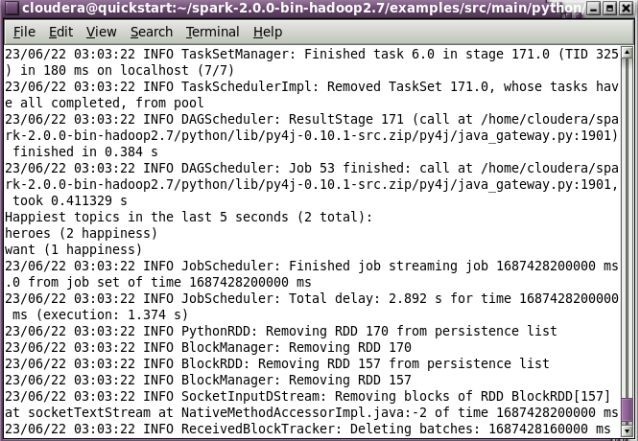
      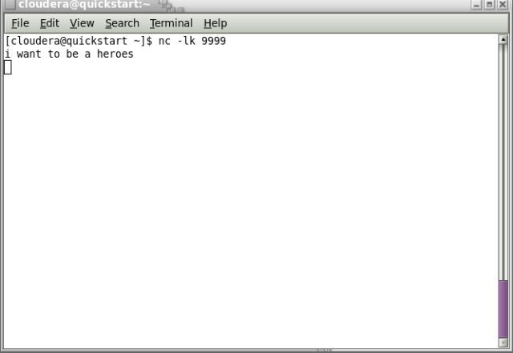
